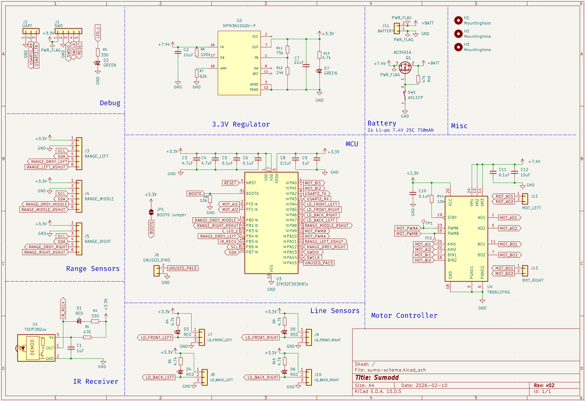
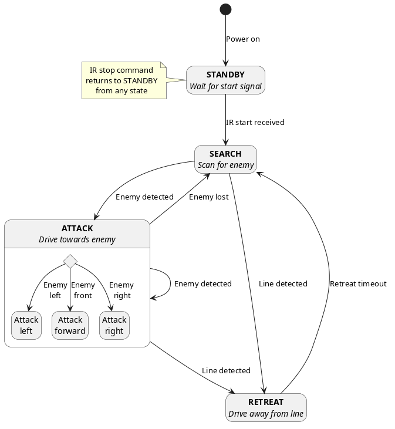

# Sumodd mini-sumo robot

Sumodd is a mini-sumo robot developed from scratch, including firmware in C, 3D modelling and PCB
design. See competition rules and robot requirements for mini-sumo robots
[here](https://robotex.international/wp-content/uploads/2025/11/Mini-sumo-rules-2025-ENG.pdf).

The idea for this project, the design of the firmware statemachine, as well as a lot of the
hardware choices were heavily inspired by [`artfulbytes`](https://github.com/artfulbytes)
excellent [youtube series](https://www.youtube.com/watch?v=g9KbXJydf8I) where he made a sumo robot
from scratch. See his project code [here](https://github.com/artfulbytes/nsumo_video).

## Hardware overview

- STM32F303K8T6 MCU with 72MHz CPU (64MHz with internal clock), 64 KB flash and 12 KB SRAM.
    - Data sheet: https://www.st.com/resource/en/datasheet/stm32f303c6.pdf
- Sensors:
    - VL53LOX time-of-flight sensors for detecting enemies.
    - QRE1113 line sensors for detecting the arena edge.
    - TSOP38238 infrared receiver for activating the robot remotely.
- TB6612FNG motor driver to control the motors.
- MPM3610 buck regulator for regulating the voltage to the MCU, ensuring it sees a steady 3.3v,
regardless of battery voltage, which fluctuates with charge.
- 6v, 500RPM geared brushed DC motors.
    - https://www.jsumo.com/mp12-micro-gear-motor-6v-500rpm
- 33mm diameter, aluminium wheels with high-friction rubber.
    - https://www.jsumo.com/slt20-aluminum-silicone-wheel-set-33mmx20mm-pair

The kicad files for the schematic and PCB layout are available in the
[sumodd-hardware repository](https://github.com/oddgrd/sumodd-hardware),
including further documentation for the parts used and their layout on the board.



## Firmware overview

- Our application code and our driver code lives in `app` and `app/drivers`.
- The [STM32CubeMX generated](#hardware-initialization) source and header files live in `Src` and
`Inc`, with some hardware initialization code moved to `app/drivers`.
- External libraries live in `external`, at the time of writing it just holds a Segger RTT library
git submodule, used for logging in debug builds.
- Integration and unit tests live in `tests`.

### State machine

Our firmware is centered around a finite state machine, defined in `app/state.c`. In the firmware
main function, we run a while loop that checks sensor inputs on each iteration, end emits an event
depending on the input. This event is fed into the state machine, and in combination with the
current state, it arrives at the next state using a lookup table of valid state transitions.



Note that we do not simply poll the sensor inputs on each iteration, we rely on interrupts and DMA
to avoid blocking the main loop. For more information on that, see the documentation for line
sensors and ranging sensors below.

### Hardware initialization

We use the STM32 HAL to configure and interact with the hardware, and we use the
[STM32CubeMX](https://www.st.com/en/development-tools/stm32cubemx.html) software to generate the
hardware initialization code, as well as the initial CMake configuration. STM32CubeMX would put all
generated initialization code in the `Src/main.c` file, but we've since moved some of the
initialization code out, so it lives next to the relevant firmware. For example, the timer
peripheral initialization code that is used to enable input capture for the IR remote lives in
`app/drivers/ir_remote.c`.

STM32CubeMX is a great tool and it has been very useful, so we may stop fighting it and move
everything back to the place it was originally generated in the future.

> The STM32CubeMX manifest has been kept up to date with manual changes to the generated code,
> so if you need to use STM32CubeMX to make changes to initialization code, or you want to easily
> visualize the hardware configuration, you can initialize a STM32CubeMX project from the
> `sumo.ioc` file in the root of this repo.

## Documentation

Documentation of the robot's core functionality can be found in the docs directory.

- [Dohyo border line detection](docs/line-detection.md)
- [Remote start IR signal handling](docs/ir-remote.md)
- [Enemy detection with IR ToF sensors](docs/ranging.md)
- [Motor control](docs/motor-control.md)

## Development

This project uses [`mise`](https://mise.jdx.dev/) to manage tools and commands/tasks. If you'd
rather not use it, inspect the `mise.toml` file to read which tools are required, and which
commands it runs.

For more information on command usage, append --help to a command, e.g. `mise run build --help`.
For an interactive overview of the available commands, run `mise run`.

### Building

```sh
# Defaults to debug
mise run build

# Alternatively, specify build preset
mise run build release
```

### Flashing

To build, flash the firmware and reset the device:
```sh
# Build preset is required, defaults to debug
mise run flash
```

To build, flash, reset and attach an RTT logger to device:

```sh
# Build preset is required, defaults to debug
mise run launch
```

To reset the device:

```sh
mise run reset
```

### Debugging

To debug the firmware, first build it with the debug preset, then install the probe-rs vscode
[extension](https://marketplace.visualstudio.com/items?itemName=probe-rs.probe-rs-debugger).
You can now start a DAP debug session with probe-rs in the vscode debugging tab.

- To launch a new debug session, which flashes first and resets the device, run the VSCode debugger
with the `.vscode/launch.json` "probe-rs launch" configuration.
- Alternatively, to attach a debugger to a running device to inspect the current state, run the VS
Code debugger with the `.vscode/launch.json` "probe-rs attach" configuration

You can also view logs sent over RTT in debug or integration test builds:

```sh
# Build preset is required, defaults to debug
mise run log
```

### Flashing without probe-rs

The mise commands depend on probe-rs. If you don't want to use probe-rs for flashing and resetting,
you can convert the .elf file to an ARM binary, then flash with st-flash, or whichever other method
you prefer:

```sh
# Create the binary
arm-none-eabi-objcopy -O binary build/debug/sumo.elf build/debug/sumo.bin

# Flash it and reset the device
st-flash --reset write  build/debug/sumo.bin 0x08000000
```

## Testing

To run the unity unit tests, run: `mise run test`

To run the various integration tests, connect the device, then repeat the build and flash steps
above, but use the desired integration test cmake preset.

The currently existing integration test presets are:

- test-drive

For example, if you want to build, flash and attach a logger to an integration test, run:

```sh
mise run launch test-drive
```

## Diagrams

[PlantUML](https://plantuml.com/) is used for diagrams, it depends on Java, which mise manages.
Furthermore, you need to install [graphviz](https://plantuml.com/graphviz-dot) on your system,
as mise cannot manage it.

To download the jar file for platuml: `mise run plantuml-setup`. The path it downloads to is set
in a mise variable, which may need to be adjusted to your local system.

To generate a UML png: `mise run plantuml-generate`. Defaults to state machine diagram UML.
