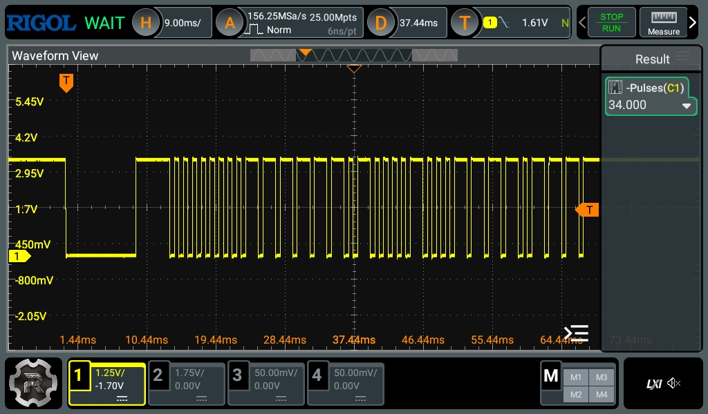

# IR Remote

### Hardware

- [TSOP38238][TSOP38238] 38kHz infrared receiver.

The [TSOP38238][TSOP38238] receiver module has a pull-up resistor from OUT to VIN (high), and
a photodiode that feeds current to the base of an NPN transistor when an IR signal burst is
received, passed through a filter to ensure we only see 38kHz bursts. This current closes the
transistor, which pulls OUT to GND (low). That is the jist of it, but there are a few more
components involved in the full circuit. Please refer to the linked [datasheet][TSOP38238]
for more information.

## NEC(x) protocol

With an [NEC protocol][nec] transmitter, we will receive a total of 34 pulses per keypress in our
IR receiver. We can decode the signal by looking at the length of the pulses (signal low) and the
spaces between them (signal high). 

- The initial 9ms pulse and 4.5ms space signals the start of a transmission.
- Next, we receive 32 pulses representing our bits. Each pulse is roughly 562μs, and we use the
space after the pulse to determine if its a logical 0 or 1. 
    - A 562μs pulse followed by an equally long space, for a 1.12ms total duration, is a logical 0.
    - A 562μs pulse followed by a 1.69ms space, for a total duration of 2.25ms, is a logical 1.
- The first 16 bits are the address of the transmitting device. Note that our transmitter is an
NECx remote, in conventional NEC the first 16 bits are 8 bits of address and 8 bits of address
inverted. In other words, NECx gives you 65536 possible addresses, as opposed to 256 with
a conventional NEC signal.
- The address bits are followed by an 8 bit command, and then the same 8 bit command inverted.
The inverted bits can be used to validate the integrity of the signal, if it is not correctly
inverted, we should discard the message.

## Signal Capture

To decode the signal, we must first capture it in our MCU. To do that, we use a timer peripheral
configured for input capturing on a GPIO input pin.

> See [RM0316 §23.4.6][rm-0316], on input capture mode for STM32f303 general purpose timers.

- The timer peripheral is configured to increment a counter at a given frequency, specified by the
clock source frequency, which can be adjusted by configuring the prescaler. In our case, we divide
the HSI 64MHz clock source by 64, setting the timer clock frequency to 1MHz.
- The timer peripheral we use is 16 bit, and we set the period to the max unsigned 16 bit value,
65535. The counter counts up to this value, then starts over from 0. At 1MHz, each counter
increment is 1μs.
- On a falling edge on the input pin, an input capture interrupt is triggered, which captures the
current count at the instant the falling edge occurred.
- We store the captured count, and subtract it from the previously recorded count, to get the
time passed between captures. We also store the pulse count, starting from 0, and incrementing for
each captured timer count.
- For now, we simply do nothing except increment the pulse count on the first two pulses, which
indicate the start of signal. Then, we start decoding the pulses as bits according to the NECx
protocol. If a segment (pulse and space) is larger than the protocol allows, we reset.
- Each bit is shifted into an unsigned 32 bit integer.
- Once we reach a pulse count of 34, we know the signal is complete. We parse the address and
command from the u32, verify the command inversion matches, place the result in a queue to be
consumed in the main loop, then reset the counter and the pulse count.

The current implementation works, but it is a bit rough, and needs work:
- The logic for determining when to break due to invalid pulses is very minimal, only checking for
too large pulses while decoding the bits, not checking for too small pulses.
- We do not have unit tests for the signal decoding logic.
- The current statemachine does not care what the command is, it only sees that a valid
command was received, and if so, it toggles the STANDBY mode.
- We do not attempt to handle NEC repeat signals.

[TSOP38238]: https://cdn.sparkfun.com/assets/c/8/5/c/8/tsop382.pdf
[nec]: https://www.infineon.com/assets/row/public/documents/60/42/infineon-an2023-03-infrared-remote-control-and-saving-last-speed-setting-applicationnotes-en.pdf?fileId=8ac78c8c8d1b852e018d21ff0aa71feb
[rm-0316]: https://www.st.com/resource/en/reference_manual/rm0316-stm32f303xbcde-stm32f303x68-stm32f328x8-stm32f358xc-stm32f398xe-advanced-armbased-mcus-stmicroelectronics.pdf