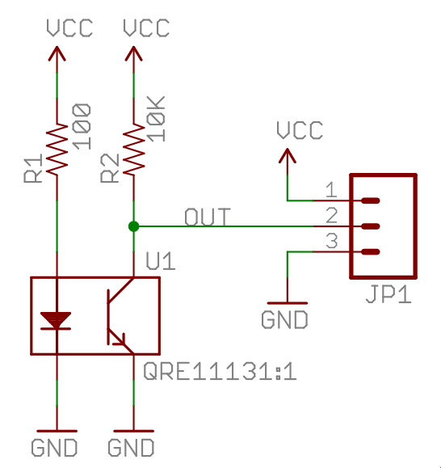

# Line Detection

- [QRE1113][qre1113] analog infrared reflective object sensor, on a [Sparkfun breakout board][qre1113-board].
- [STM32F303K8T6][mcu] MCU on-chip successive approximation register (SAR)[analog-to-digital converter][rm-0316] (ADC).

// TODO: how it fits into the state machine?

<strong>Sparkfun QRE1113 Analog Schematic</strong>

For detecting the white line around the dohyo, we use four QRE1113 analog breakout boards. This
board has the [QRE1113][qre1113] sensor, which consists of an IR emitter, as well as a phototransistor. On the board, the transistor collector is pulled high to VIN with a 10k resistor.
See schematic in the dropdown above.

The more IR light that hits the phototransistor base, the more current is pulled through the
resistor, and on through the transistor to ground. The sensor output pin connects to the node
between the resistor and the transistor collector, and as the current through the resistor 
increases, by Ohm's law, the voltage drop across it increases. For example, if the current through
the resistor is 200uA, the voltage drop across it is: `0.0002A * 10 000 = 2V` (V = I * R), leaving
the output voltage at 1.3V.

The sensor has a very short range, we'll need to keep it at about 2mm from the dohyo surface to
get consistent readings.

To summarize:

- When reflection is low, e.g. on the black center of the arena, the voltage at the output pin is
high.
- When reflection is high, e.g. on the white surface of the dohyo border, the output voltage is
low.

This can be seen in the GIF below, we're we've attached the scope probe to the sensor output, and
we're powering the sensor with 3.3V on VIN. We start with the sensor above a dark surface, at which
point the output voltage is close to the VIN voltage. Then, we move a white sheet of paper closer
and closer to the sensor, until we move it right next to it, at which point the voltage bottoms out
around 250mV.

## ADC

> Configuration of the ADC and timer is done in the [line sensor driver](../app/drivers/line_sensor.c).

We use one of the MCU's on-chip SAR ADCs to convert the analog output from the QRE1113 line sensors
to digital values. Since we want the robot to move quickly, and the line around the dohyo is narrow,
we need to ensure the line sensors outputs are converted frequently enough for the robot to act in 
time when a line is detected, or it will drive out of the dohyo. But, we also want to avoid
converting much more frequently than we need because it can be a waste of limited resources (e.g.
by triggering excessive interrupts, if enabled).

So, rather than converting continuously, as quickly as the ADC is able, we control the frequency
of conversions with a timer peripheral.

### Timer trigger

The ADC conversion is not continuous, it is triggered by a timer peripheral update event. The timer
is configured to count upwards until it reaches the configured `period`, at which time it emits an
event and resets the counter. The counter is incremented each clock cycle, so by adjusting the clock,
using the timer prescaler, and adjusting the period, we can set the frequency of the events.

For example, with an input clock of 64MHz:

1. We set the prescaler to 64, dividing the clock frequency down to 1MHz.
2. We set the period to 100. At 1MHz, each tick is 1us.

The timer will increment the counter every cycle. Once it reaches 100 (99), it will emit an update
event, and reset the counter. At 1MHz, 100 cycles is 100us, or a frequency of 10kHz.

### ADC Conversion

Once the ADC receives an update event from the timer, it starts conversion of all four ADC
channels. As the conversions complete, they are written to a buffer in memory by the direct
memory access controller (DMA). This means no CPU cycles are spent reading from the ADC and
writing to memory, this is handled entirely by the DMA controller. The MCU firmware simply
reads the buffer when it needs to.

We could enable interrupts for the DMA operation to be complete, or even to be halfway complete,
and then read the value with the MCU, but at the time of writing, we simply read the buffer
whenever we can in the main loop statemachine, so the DMA interrupts are disabled.

#### Conversion time

We can calculate the total time for a conversion with the following data (see
[RM0316 §15.3.16][rm-0316]):

- The clock source, which we know is 64MHz from HSI without division.
- The resolution, `RES`, which we set to 10 bits.
- `t_smpl`, the time spent capturing the voltage with the ADC capacitor. We set this to 4.5 cycles,
since faster sampling than that led to ADC channel crosstalk.
- `t_sar`, the time spent in successive approximation (SAR), where the voltage of the sample capacitor
is converted to a digital representation. The cycles spent here increase with increased resolution.
At 10 bit `RES`, 10.5 cycles are needed for the SAR phase.

To see what `RES` corresponds to in `t_sar`, see [RM0316 §15.3.22][rm-0316].

Combining `t_smpl` and `t_sar`, we arrive at 15 cycles per conversion. If we divide the clock
frequency by the cycles, `64MHz / 15`, we arrive at ~4.27 Msps (megasamples per second). However,
each time we start a conversion in the ADC, we convert all four channels, so 60 cycles for all
sensors to be read, `64MHz / 60`, roughly 1.07 Msps.

We could likely go down to 8 bits `RES`, we do not need high resolution, after all, we just need to
see if there is a line or not, but 1.07 Msps is plenty for this robot. Going down to 8 bits would
only reduce `t_sar` to 8.5 cycles, increasing the total sampling rate to about 1.23 Msps.

Either way, the ADC can sample much faster than the conversion frequency we configure with the
timer peripheral. And that is important, if the timer peripheral triggers conversions faster than
the DMA can transfer the result to memory, the DMA requests will be blocked, and the buffer may
end up frozen.

See [RM0316 §15.3.26, ADC overrun][rm-0316].

[mcu]: https://www.st.com/en/microcontrollers-microprocessors/stm32f303/documentation.html
[rm-0316]: https://www.st.com/resource/en/reference_manual/rm0316-stm32f303xbcde-stm32f303x68-stm32f328x8-stm32f358xc-stm32f398xe-advanced-armbased-mcus-stmicroelectronics.pdf
[qre1113]: https://cdn.sparkfun.com/datasheets/Sensors/Proximity/QRE1113.pdf
[qre1113-board]: https://www.sparkfun.com/sparkfun-line-sensor-breakout-qre1113-analog.html