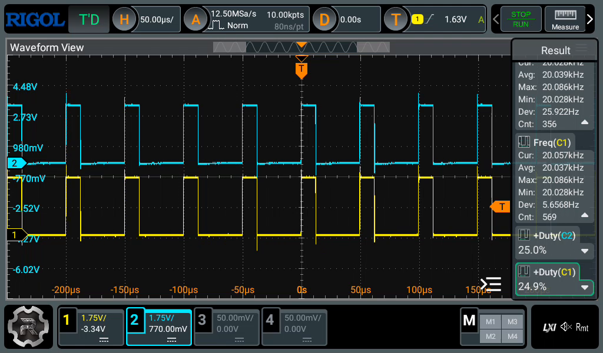
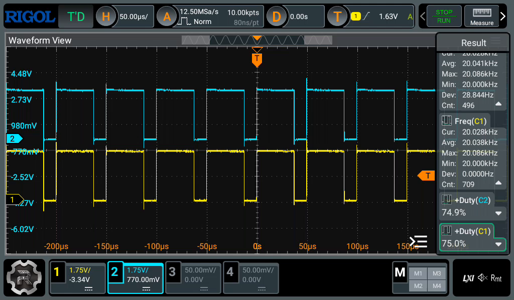
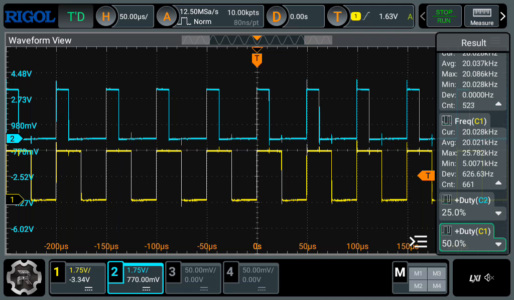

# Motor control

## Hardware

- [TB6612FNG][TB6612FNG] motor driver.

We cannot power the motors directly from the MCU, as they will need higher voltages than the MCU
can supply, and significantly higher currents. The STM32F303K8T6 is rated for at most 25mA from
any output pin, and 80mA total across all pins, whereas our motors at the time of writing have a
an idle current of 50mA, and stall current of 0.8A. Furthermore, we are using brushed DC motors,
so we also need to be able to reverse the supply polarity, to reverse the direction the motors
spin. Therefore, we will use a MOSFET based H-bridge motor driver, which can control two motors.

We landed on the [TB6612FNG][TB6612FNG] motor driver for the first iteration, the one used in the
[nsumo project](https://github.com/artfulbytes/nsumo_video).

- It takes motor power directly from our battery on the VM pin, and it can output up to 1.2A
continuous current per motor output channel. It uses PWM to control the output voltage to the
motors.
- The motor driver does not have a clock, the MCU provides the PWM signal using a timer peripheral,
and supplies it to the two motor driver PWM input pins, one for each motor, so their speed can be
controlled separately.
- For each motor, the driver has two additional input pins, used to control the direction of the
motor. These open and close transistors in the H-bridge, which reverses the polarity of the voltage.
This can be used to control the direction of the motors, clockwise or counter-clockwise.

### Motor PWM

It is important that the frequency of the PWM signal is high enough that we reduce current ripples,
which happens when the switching period is slow enough that the motor does not see the average
voltage we want it to see, rather it will see signficantly fluctuating voltage, which means the
motor will not spin smoothly.

To generate the PWM signal, we use a timer peripheral on the MCU. The PWM frequency (f_PWM) is
determined by the timer input clock (f_TIM), the prescaler register (PSC), and the auto-reload
register (ARR):

`f_PWM = f_TIM / ((PSC + 1) * (ARR + 1))`

For example, if the timer input clock is 64 MHz and we configure:

```
PSC = 31
ARR = 99
```

then:

```
f_PWM = 64 MHz / ((31 + 1) * (99 + 1))
      = 64 MHz / (32 * 100)
      = 20 kHz
```

This gives a PWM period of 50 µs.

We can control the duty cycle, how long each pulse is HIGH, from our application, by setting the
capture and compare register (CCR) for the timer channel we are using to generate the PWM signal.
When the counter is smaller than the CCR value, the channel output will be HIGH. When it is greater
than or equal to the CCR value, channel output will be low.

For example, if we set the CCR register to 50:

- When the counter is between 0 and 50, the output will be HIGH.
- When the counter is between 50 and 100, the output will be LOW.

This leaves the PWM duty cycle at 50%, as it is HIGH 50% of the period. The motor driver will use
this signal to switch the voltage it supplies to the motor (from VM) on and off at f_PWM, which
will provide an average voltage to the motor. If the input from VM is 6V, at 50 CCR the motors
will see 3V.

If we attach an oscilloscope to the PWM outputs from the MCU, we can verify it has the expected
20kHz frequency, as well as the duty cycle we set with the CCR register.


<details>
<summary><strong>Oscilloscope captures of motor control PWM output pins</strong></summary>

First, lets look at both channels, symmetrically set to 25% duty cycle, meaning both motors are
running at the same speed:



And 75% duty cycle:



But we can also control the motors asymetrically, for example if we want to do a wide arc turn,
we can set one motor to a higher speed than the other, so the motor turns in the direction of the
slow motor. Here we set the left motor to 25% duty cycle, and the right to 50%, so the robot will
turn gradually towards the left.



</details>

## Risks

- The TB6612FNG only supports up to 1.2A continuous current per motor. With our current motors, at
their rated max of 6V, the stall current is 0.8A. However, they can be pushed up to 12V according
to the manufacturer, which should increase the stall current to 1.6A, which is above above the
drivers rating.
    - We should consider switching to a larger dual channel motor driver, or use two larger single
    channel motor drivers.
    - The motor driver, this one or the new one, will produce significant heat at the high current
    and voltage when stalling. When we overvoltage the motor up to 12V, the power consumption of
    the motors actually quadruples, because both voltage and stall current are doubled:
    `12V * 1.6A = 19.2W`, vs `6V * 0.8A = 4.8W`. We need to consider this in our PCB design, and
    in our motor mount design.
- We use a JST-PH 2-pin connector for our battery and motor output cables. These connectors are
rated for 2A continuous current.
    - We should switch to higher AWG wires, and use clamping power terminals rather than JST-PH
    connectors.

[TB6612FNG]: https://toshiba.semicon-storage.com/info/TB6612FNG_datasheet_en_20141001.pdf?did=10660&prodName=TB6612FNG