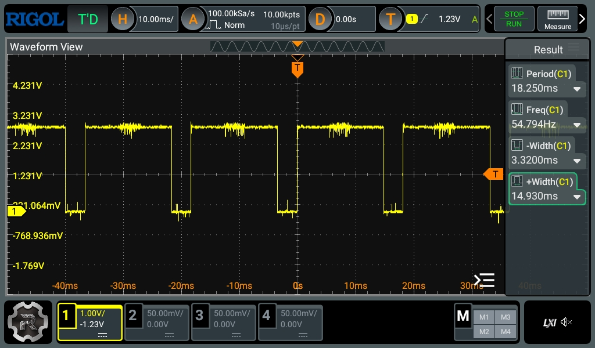
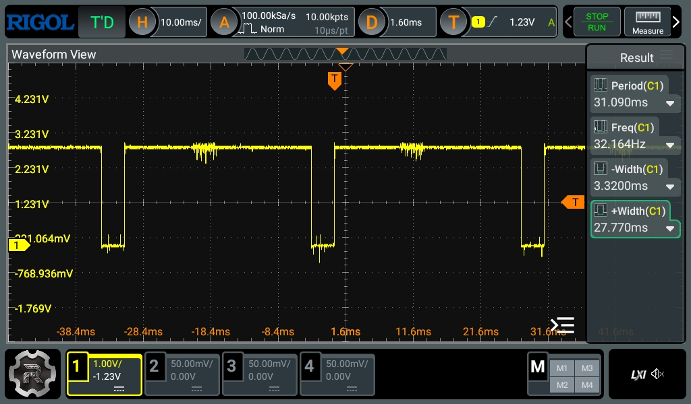

# Ranging

## Hardware

- [VL53L0X][vl53l0x] Time-of-Flight ranging sensor x3 on Adafruit breakout boards:
https://www.adafruit.com/product/3317.

The VL53L0X has a 940NM IR laser, and a single photon avalance diode (SPAD) array. It measures the
time taken from emitting the laser, to receiving it in the SPAD array, the time of flight. The
sensor can take range measurements at a rate of about 50Hz, if configured with the lowest possible
timing budget of ~20ms. That leaves us at the same max range of 1.2m, but it reduces the accuracy
by up to 5%, compared to the ideal timing budget of 33ms (see [§6.3.2 in the datasheet][vl53l0x]). 

## I2C Interface

The ranging data is read over I2C. The VL53L0X supports ut to 400kHz I2C clock speeds. Since we
have three sensors, and they all share the same default I2C address, we need to use the provided
XSHUT pin to turn the other sensors off, as we write to each sensor one by one on the default
address to set a new, unique I2C address for each.

We configure the sensor to continuously range, as frequently as it can within the given timing
budget. It can be polled over I2C to see when data is ready, but it also has a GPIO output pin that
can be configured as a data ready pin, which is pulled low when measurement data is ready. We
connect it to an MCU EXTI pin set to trigger an interrupt on the falling edge, set a flag that the
data is ready in the ISR, then read the data over I2C when it is the highest priority task in the
state machine. After reading the data, we reset the VL53L0X data ready output pin over I2C.

If we connect an oscilloscope to this data ready GPIO pin, we can see that:
- The VL53L0X taking the time-of-flight measurement takes about ~15ms (on 20ms timing budget).
- The data ready output pin is pulled low for about ~3.5ms before it is reset. The time spent here
is in the I2C calls needed to read the data, and then the I2C write calls to reset the pin. This
is longer than expected for a few bytes of I2C reads and writes at 400kHz, but we are running three
VL53L0X sensors on the same I2C bus, so the delay is likely due to blocking from the other sensors
I2C operations.

In the second scope screenshot with a higher measurement timing budget, we can see that the low
pulse is the same, about 3.5ms, but the high pulse is almost doubled at 27ms. For more information
on the ranging timings, see [§3.6 in the datasheet][vl53l0x].

<strong>Oscilloscope captures of VL53L0X GPIO pin</strong>

VL53L0X GPIO output pin at 20ms measurement timing budget:

VL53L0X GPIO output pin at 33ms measurement timing budget:

## Risks

### Measurement frequency

The VL53L0X gives us accurate distance measurements covering the full area of the dohyo. However,
it is relatively slow at a peak measurement frequency of just over 50Hz. It is already a bottleneck
at the time of writing, we cannot spin faster than 50% speed and still detect opponents reliably.

### Ambient light

The sensor is susceptible to noise from ambient light, especially when exposed to sunlight. It
performs quite well indoors in a controlled environment, but it needs to be reliable in the varying
environments of tournament arenas.

There are knobs we can tweak to discard measurements with high standard deviation, weak signal
strength etc., which is documented further in the [code](../app/ranging.c). But at an already
low measurement frequency of 50Hz, discarding bad measurements can lead to missed targets. We can
also attach cover glass to the sensor, to reduce crosstalk, and to reduce sensitivity to ambient
light. This significantly raises the cost, however, as the glass costs more than the sensor itself.
For more data on the ranging capabilities indoors vs outdoors, and on light vs dark targets, see
[§6.2 - 6.3 in the datasheet][vl53l0x].

### Driver complexity

These ToF sensors are fairly complicated devices, and the driver/API provided by ST is
very significant. Tntegrating it into our firmware more than doubled our optimized build size. We
have quite a bit of flash to work with still, but are almost maxed out in debug builds. We would
need to take some time to trim the driver provided by ST.

### Hardware

The Adafruit breakout board is quite large, and comes with STEMMA QT connectors that we don't use,
because they are just for I2C, GND and VIN, but we also need to connect the DRDY GPIO and XSHUT.
It may not have room to fit a cover glass, either. That means we need to consider whether we should
design our own, custom PCB to mount the sensor, using Adafruit's open source design as a guide, as
well as ST's documentation.

## Alternatives

- We could upgrade to VL53L4CD, a newer version of the sensor, which is more accurate at shorter
ranges, can measure at a max frequency of about 100Hz, and supports I2C speed of 1MHz. it has a
shorter max range, but still plenty for the dohyo. It is a clear and significant improvement over
the VL53L0X for our use case.
    - We would still need to purchase cover glass to reduce ambient light sensitivity.
    - Adafruit and others sell breakout boards for this one as well, at the same price, but they
    generally have the same problems we discussed above.
    - 100Hz is good, and the 1Mhz I2C speed will help, but it will still become a bottleneck as the
    robots driving speed and handling improves.
    - We would need to swap out the driver.
- We could consider switching to simpler IR sensors that do not give us accurate distance
measurements, they simply tell us whether there is a target ahead or not, but they can operate at
much faster frequencies, at least an order of magnitude faster. They should also work well at the
mini-sumo dohyo diameter of 77cm.
    - However, we have some experience with the ToF sensors now, we will likely have new challenges
    with simple IR sensors. We don't know how well they handle ambient light, including the IR from
    the opponents IR emitters.
    - Might struggle with weak reflections from dark opponents producing weak signals, that may be
    hard to distinguish from ambient noise.
    - Might struggle at the max distances of the dohyo.
- We have not considered ultra-sonic sensors much, as they do not seem to be used in competitive
sumo bots at all, they are fairly slow (10-50Hz measurement frequency), and they are quite large
compared to IR or ToF.

[vl53l0x]: https://www.st.com/resource/en/datasheet/vl53l0x.pdf