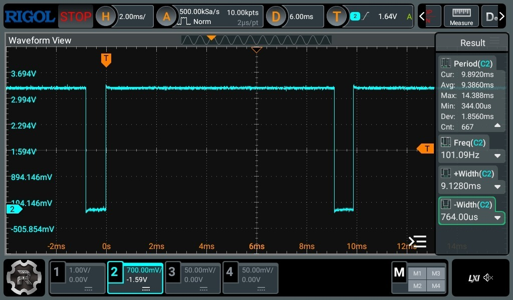

# Ranging

## Hardware

- [VL53L4CD][VL53L4CD] Time-of-Flight ranging sensor x3 on custom, minimal PCBs. The KiCad files
for these boards, as well as further documentation for the hardware, can be found in the
[Auge repo](https://github.com/oddgrd/auge), and the
[sumodd-hardware repo](https://github.com/oddgrd/sumodd-hardware#vl53l4cd-time-of-flight-sensors).

The VL53L4CD has a 940NM IR laser, and a single photon avalance diode (SPAD) array. It measures the
time taken from emitting the laser, to receiving it in the SPAD array, the time of flight. The
sensor has a max range of 1200-1300mm at the full timing budget of 33ms (see [table 16][VL53L4CD]),
but the robot only needs to see within the 770mm dohyo, so it's configured with a 10ms budget, for
a ranging measurement rate of 100Hz. Note that the fast timing budget also reduces accuracy, but by
how much is not documented in the datasheet. 

## I2C Interface

The ranging data is read over I2C. The VL53L4CD supports ut to 1MHz I2C clock speeds, with the
correct selection of pullup and series resistors (more on that in the 
[Auge repo](https://github.com/oddgrd/auge)). Since we have three sensors, and they all share
the same default I2C address, we need to use the provided XSHUT pin to turn the other sensors off,
as we write to each sensor one by one on the default address to set a new, unique I2C address for
each.

We configure the sensor to continuously range, as frequently as it can within the given timing
budget. It can be polled over I2C to see when data is ready, but it also has a GPIO output pin that
can be configured as a data ready pin, which is pulled low when measurement data is ready. We
connect it to an MCU EXTI pin set to trigger an interrupt on the falling edge, set a flag that the
data is ready in the ISR, then read the data over I2C when it is the highest priority task in the
state machine. After reading the data, we reset the VL53L4CD data ready output pin over I2C.

If we connect an oscilloscope to this data ready GPIO pin, we can see that:
- The VL53L4CD taking the time-of-flight measurement takes about ~9ms (on 10ms timing budget).
- The data ready output pin is pulled low for about ~0.8ms before it is reset. The time spent here
is in the I2C calls needed to read the data, and then the I2C write calls to reset the pin.

VL53L4CD data ready output pin at 10ms measurement timing budget:

## Risks

### Measurement frequency

The VL53L4CD gives us accurate distance measurements covering the full area of the dohyo. However,
it is relatively slow at a peak measurement frequency of just over 100Hz. It's a significant
upgrade over the VL53L0X used in the past, which had 50Hz measurement frequency, but it's still
a lot slower than a simpler, analog IR sensor.

### Ambient light

The sensor is susceptible to noise from ambient light, especially when exposed to sunlight. It
performs quite well indoors in a controlled environment, but it needs to be reliable in the varying
environments of tournament arenas.

There are knobs we can tweak to discard measurements with high standard deviation, weak signal
strength etc., but at an already low measurement frequency of 100Hz, discarding bad measurements
can lead to missed targets. We can also attach cover glass to the sensor, to reduce crosstalk, as
well as sensitivity to ambient light. This significantly raises the cost, however, as the glass
costs more than the sensor itself. For more data on the ranging capabilities indoors vs outdoors,
and on light vs dark targets, see [§6.3 - 6.4 in the datasheet][VL53L4CD].

[VL53L4CD]: https://www.mouser.com/datasheet/2/389/vl53l4cd-2907214.pdf