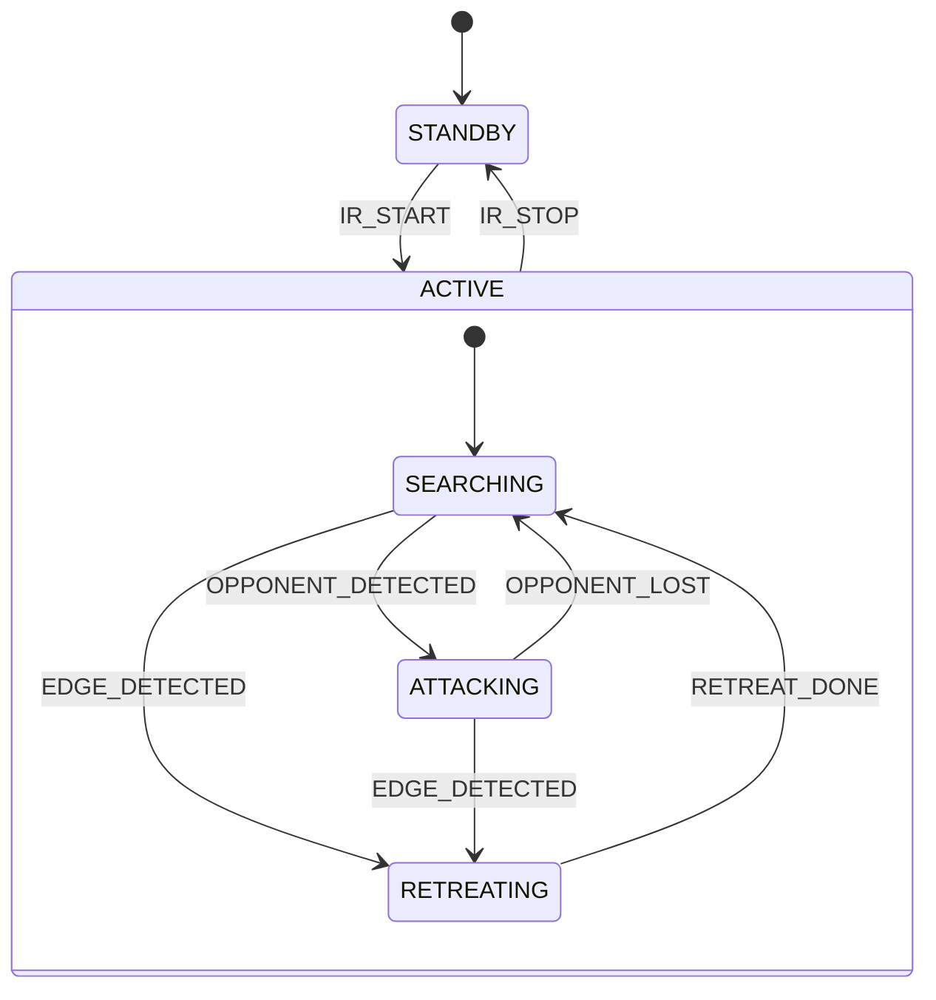

```mermaid
stateDiagram-v2
    [*] --> STANDBY

    STANDBY --> ACTIVE : IR_START

    state ACTIVE {

        [*] --> SEARCHING

        SEARCHING --> ATTACKING : OPPONENT_DETECTED
        ATTACKING --> SEARCHING : OPPONENT_LOST

        SEARCHING --> RETREATING : EDGE_DETECTED
        ATTACKING --> RETREATING : EDGE_DETECTED
        RETREATING --> SEARCHING : RETREAT_DONE
    }

    ACTIVE --> STANDBY : IR_STOP
```